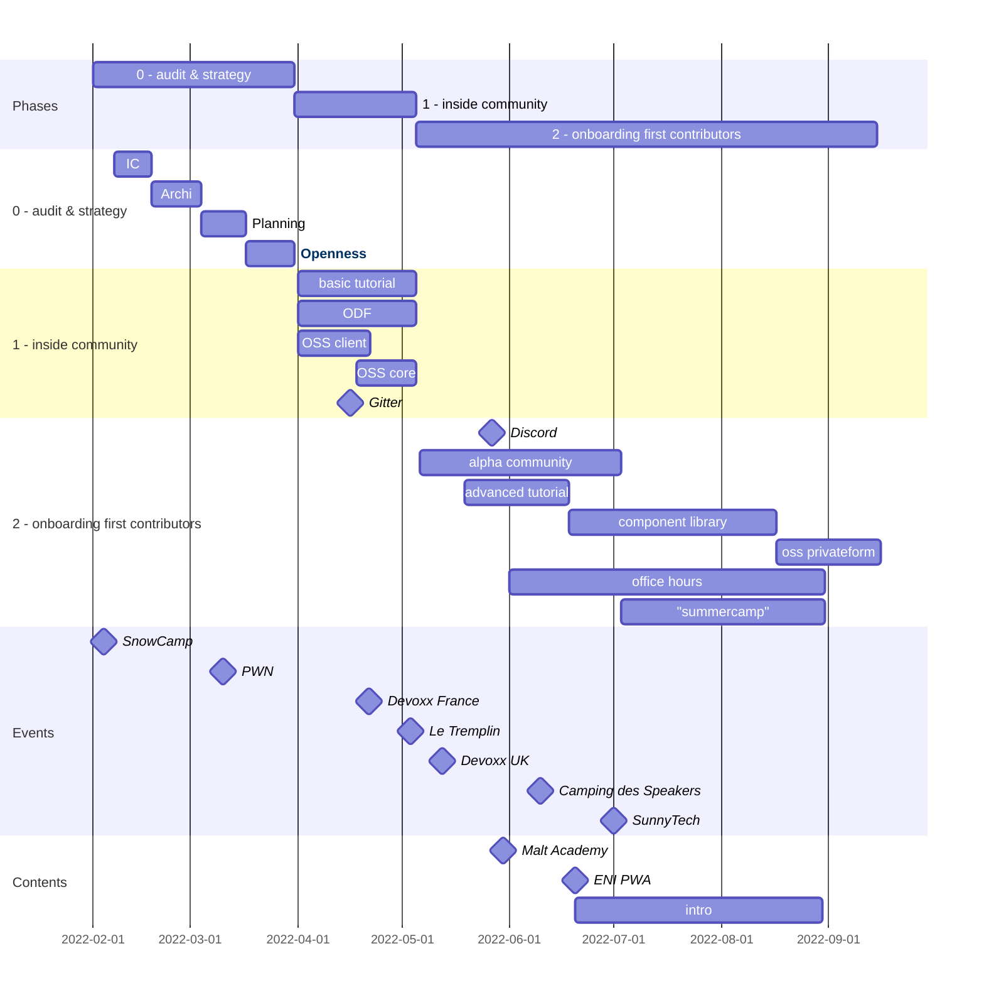

# Community Building - 2022 - Timeline

```mermaid
gantt
    dateFormat  YYYY-MM-DD

    section Phases
      0 - audit & strategy : p0, 2022-02-01, 2022-03-31
      1 - inside community : p1, after p0, 2022-05-05
      2 - onboarding first contributors :  p2, after p1, 2022-09-15

    section 0 - audit & strategy
      IC: ic, 2022-02-07, 2022-02-18
      Archi: arch, after ic, 2022-03-04
      Planning: plan, after arch, 2022-03-17
      Openness: open, after plan, 2022-03-31
      click open href "https://github.com/blindnet-io/devrel-planning/issues/15"

    section 1 - inside community
      basic tutorial: tuto, 2022-04-01, 2022-05-05
      ODF: odf, 2022-04-01, 2022-05-05
      OSS client: ossc, 2022-04-01, 2022-04-22
      OSS core: osss, 2022-04-18, 2022-05-05
      Gitter: milestone, 2022-04-16, 0d

    section 2 - onboarding first contributors
      %% twitter: milestone, 2022-05-06, 0d
      %% dev.to: milestone, 2022-05-13, 0d
      %% reddit: milestone, 2022-05-20, 0d
      Discord: milestone, 2022-05-27, 0d
      alpha community: alpha, 2022-05-06, 2022-07-03
      advanced tutorial: atuto, 2022-05-19, 30d
      component library: clib, after atuto, 60d
      oss privateform: after clib, 30d
      office hours: offh, 2022-06-01, 2022-08-31
      "summercamp": sumcp, after alpha, 2022-08-31

    section Events
      SnowCamp: milestone, 2022-02-02, 4d
      PWN: milestone, 2022-03-10, 1d
      Devoxx France: milestone, 2022-04-20, 3d
      Le Tremplin: milestone, 2022-05-03, 1d
      Devoxx UK: milestone, 2022-05-11, 3d
      Camping des Speakers: milestone, 2022-06-09, 2d
      SunnyTech: milestone, 2022-06-30, 2d

    section Contents
      Malt Academy: milestone, 2022-05-30, 0d
      ENI PWA: milestone, 2022-06-20, 0d
      intro: 2022-06-20, 2022-08-30
```
