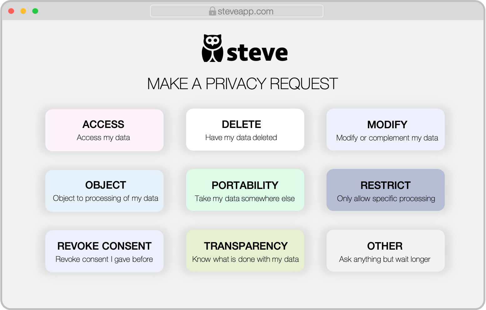

# blindnet devkit for Digital Insurance Apps

| **Author(s)** | [milstan](https://github.com/milstan) (milstan@blindnet.io)             |
| :------------ | :------------------------------------------------------------------------------------- |
| **PR**   | [#49](https://github.com/blindnet-io/devrel-management/pull/49) |
| **Version**   | 1.0                                                                             |
| **Updated**   | 2022-07-13                                                                             |

## Client Profile : Steve

Steve is a health insurance app loved by digital natives who enjoy its user experience and simplicity.

## Context

Gaining users' trust is a key element of success in commercialization of digital services.
Where a human salesman is absent, trust is achieved through technology.

Privacy, giving users control over their data, and compliance with regulations are key drivers of trust online (cf. [research](#references)).

## Current Situation

Currently, if users what to take control over their data, restrict its processing or exercise their rights (granted by GDPR, CCPA or other regulations) they are expected to write an e-mail to **privacy@steveapp.com**.

This is problematic on several levels:
- **E-mail is not secure.**
Users might end-up disclosing confidential or health-related information over e-mail which would be a direct violation of [Article 32 of GDPR](https://gdpr-info.eu/art-32-gdpr/), heavily sanctioned by most major in the EU.

- **Requests are difficult to automate**.
Expressed in the form of free text of an e-mail, Privacy Request must be read and processed by a human, which is cost-intense and slow.
Linking the Requests and the responses to the actual data that Steve has is very cumbersome and requires software development involving many components of the Steve backend system.

- **It is out of sync with the values of the brand**.
Steve is perceived as secure, modern, efficient, transparent. In other words everything this experience is not.

## Using blidnet devkit

It takes three easy steps for Steve to include the most advanced privacy features in its existing software:

### Step 1 - Configuration

Steve feeds blidnet devkit with general information (Privacy Policy, server locations, retention policies) and provides a mapping between data categories in its database and [PRIV](https://github.com/blindnet-io/product-management/blob/main/refs/schemas/priv/RFC-PRIV.md) terms.

blindnet's PRIV (Privacy Request Interchange Vocabulary) is an easy-to use taxonomy of tags - an entry point to the a whole world of automation. It allows to connect an existing system with blindnet's knowledge base and rule engines in oder to deliver the ultimate privacy experience.

### Step 2 - Report key events

Whenever an important thing happens - a user opens an account, signs a contract or cancels a subscription Steve lets blindnet devkit know. A chain of events is constructed. With every new event the blindnet's Privacy Compiler updates a state of allowed processing.

When a user makes a Privacy Request, the Privacy Compiler is able to resolve it against that state and deliver response recommendations or automatically issue responses.

Even regardless of any user action, Privacy Compiler can spot data the retention policies of which have expired.

### Step 3 - Replace the e-mail with Privacy Request Builder

Finally, Steve can replace the **privacy@steveapp.com** with a convenient interface allowing users to make privacy requests.
Many requests can be replied to immediately with no human intervention (e.g. Transparency requests).
In some cases Privacy Complier can be configured to only deliver response recommendations, subject to human validation.

Only requests not falling into any of the PRIV categories still require human intervention.

## Result

Thanks to blindnet devkit Steve can lower the costs of processing Privacy Requests.
Complying with privacy regulation mandates becomes an opportunity to build trust and offer superior user experience consistent with the brand's values.

## Need more?

blindnet devkit does much more. It is a complete solution for [privacy-enabled connectedness](https://github.com/blindnet-io/product-management/blob/main/refs/notion-of-privacy/notion-of-privacy.md), allowing developers to quickly gain ground on all the three pillars of privacy: [Transparency, Confidentiality and Control](https://github.com/blindnet-io/product-management/blob/main/refs/notion-of-privacy/principles/RFC-SPEP.md).

- *Working with sensitive data?* Offer end-to-end encryption using [blidnent's encryption services](https://github.com/blindnet-io/api-scala)
- *Sharing Data with partners?* Propagate users' Privacy Requests using blindnet's [Privacy Request Multicast Protocol](https://github.com/blindnet-io/product-management/blob/b7d2bd0aab509a5d83ed42822b0ba19e27bef905/refs/schemas/protocols/RFC-PRMP.md)

## References

- [Cisco 2022 Data Privacy Benchmark Study](https://www.cisco.com/c/en/us/about/trust-center/data-privacy-benchmark-study.html)
- [Blindnet's White Paper: The Mixed Feelings of Privacy. May 2022](../research/White-Paper-May-2022.pdf)
